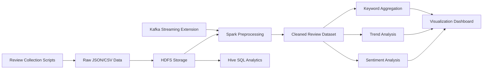

<div align="center">

# 🛒 Real-Time Shopping Review Analytics Platform

> Distributed Big Data Processing System for Large-Scale E-Commerce Review Analysis

<br>


<br>

### 2026 Big Data Programming Final Project

</div>

---

# 📌 Project Overview

본 프로젝트는 Hadoop Ecosystem 기반의 Distributed Big Data Analytics Platform을 구축하고, 대규모 온라인 쇼핑 리뷰 데이터를 수집, 저장, 처리, 분석하기 위한 End-to-End Data Processing Pipeline을 구현하는 것을 목표로 합니다.

특히 Hadoop, Spark, Hive, Kafka 등의 기술을 활용하여:

- 대규모 리뷰 데이터 분석
- 소비자 행동 패턴 분석
- Sentiment Analysis
- 실시간 데이터 처리 구조 설계

를 수행합니다.

---

# 🎯 Project Goals

본 프로젝트의 주요 목표는 다음과 같습니다.

- Hadoop 기반 Distributed Storage Environment 구축
- 대규모 리뷰 데이터 처리
- Spark 기반 Distributed Processing 학습
- Hive 기반 SQL Analytics 수행
- Kafka 기반 Streaming Architecture 설계
- 실시간 데이터 분석 구조 이해
- Visualization Dashboard 구현

---

# 🧠 Problem Definition

현대 E-commerce 플랫폼에서는 대규모 리뷰 데이터가 지속적으로 생성됩니다.

하지만 이러한 데이터는:

- 데이터 양이 매우 크고,
- 비정형 텍스트가 포함되며,
- 실시간으로 계속 증가하기 때문에

기존 단일 시스템 환경에서는 효율적으로 처리하기 어렵습니다.

본 프로젝트에서는 Hadoop Ecosystem 기반 분산 처리 환경을 활용하여:

- 리뷰 데이터 저장
- 데이터 전처리
- 감성 분석
- 트렌드 분석
- 실시간 데이터 처리 구조

를 구현하고자 합니다.

---

# ❓ Research Questions

본 프로젝트에서는 다음과 같은 분석 문제를 해결하고자 합니다.

### 1️⃣ 어떤 상품 카테고리가 가장 높은 만족도를 가지는가?

- 평균 평점 분석
- Positive Review 비율 분석
- 카테고리별 선호도 분석


### 2️⃣ 리뷰 트렌드는 시간에 따라 어떻게 변화하는가?

- 월별 리뷰 변화
- 시즌별 소비 패턴 분석
- 인기 상품 변화 분석


### 3️⃣ 어떤 키워드가 자주 등장하는가?

- Frequent Keyword Analysis
- 상품별 핵심 키워드 추출
- 감성 키워드 분석


### 4️⃣ 실시간 데이터 처리 구조는 어떻게 설계할 수 있는가?

- Kafka 기반 Streaming 구조 설계
- Spark Streaming Architecture 구성
- 실시간 이벤트 처리 파이프라인 설계

---

# 🏗️ System Architecture



---

# ⚙️ Technology Stack

본 프로젝트에서는 아래와 같은 기술 스택을 사용합니다.


## ☁️ Cloud & Environment

| Technology | Purpose |
|---|---|
| GCP | Cloud Infrastructure |
| Ubuntu | Linux Environment |
| Docker | Container Environment |


## 🗄️ Big Data Ecosystem

| Technology | Purpose |
|---|---|
| Hadoop | Distributed Computing |
| HDFS | Distributed Storage |
| Spark | Distributed Data Processing |
| Hive | SQL-based Analytics |
| Kafka | Streaming Architecture |
| Python | Data Processing & Crawling |

---

# 📂 Dataset

## Data Sources

본 프로젝트에서는 공개 E-commerce Review Dataset을 활용합니다.

예상 데이터 출처:

- Amazon Product Reviews Dataset
- Kaggle E-commerce Review Dataset
- Public Shopping Review APIs


## Expected Data Size

| Type | Size |
|---|---|
| Raw Review Data | 100MB+ |
| CSV / JSON Files | Multiple Files |
| Processed Data | Hive Tables / Parquet |

---

# 🔄 Data Pipeline

## 1️⃣ Data Collection

Python Crawling 및 API 기반 데이터 수집을 수행합니다.

### 주요 작업

- 리뷰 데이터 수집
- JSON / CSV 변환
- 자동 수집 스크립트 구성


## 2️⃣ HDFS Storage

수집한 데이터를 HDFS에 저장합니다.

### 주요 작업

- Distributed File Storage
- 데이터 분산 저장
- Partition 기반 데이터 관리


## 3️⃣ Spark Preprocessing

Spark 기반 데이터 전처리를 수행합니다.

### 주요 작업

- Missing Value Handling
- Duplicate Removal
- Text Normalization
- Rating Filtering
- Tokenization


## 4️⃣ Hive Analytics

Hive SQL 기반 데이터 분석을 수행합니다.

### Example Query

```sql
SELECT category,
AVG(rating) AS avg_rating,
COUNT(*) AS review_count
FROM reviews
GROUP BY category
ORDER BY avg_rating DESC;
```


## 5️⃣ Sentiment Analysis

리뷰 텍스트 기반 감성 분석을 수행합니다.

### 분석 항목

- Positive / Negative Review
- Sentiment Score
- Keyword-based Sentiment Analysis


## 6️⃣ Streaming Architecture

Kafka 기반 실시간 데이터 처리 구조를 설계합니다.

### 주요 기능

- Real-time Event Streaming
- Streaming Pipeline
- Event Queue Management


## 7️⃣ Visualization Dashboard

분석 결과를 시각화합니다.

### Visualization Examples

- 리뷰 추세 그래프
- 카테고리별 평점 차트
- 소비 패턴 분석
- Keyword Frequency Graph

---

# 📊 Expected Results

본 프로젝트를 통해 다음과 같은 결과를 기대합니다.

- 소비자 행동 패턴 분석
- 상품 선호도 분석
- 감성 분석 기반 인사이트 도출
- 실시간 리뷰 처리 구조 설계
- Hadoop 기반 분산 처리 경험 확보

---

# 📁 Repository Structure

```text
real-time-shopping-review-analytics/
│
├── README.md
├── data/
│   └── sample/
│
├── src/
│   ├── ingest/
│   ├── preprocessing/
│   ├── hive/
│   ├── streaming/
│   └── visualization/
│
├── scripts/
├── results/
├── docs/
└── .github/
```

---

# 🚀 Execution Plan

| Week | Goal |
|---|---|
| Week 11 | Topic Selection & Repository Setup |
| Week 12 | Data Collection & HDFS Configuration |
| Week 13 | Spark/Hive Pipeline Implementation |
| Week 14 | Visualization & Analysis |
| Week 15 | Final Presentation & Report |

---

# 🔥 Bonus Point Features

본 프로젝트에서는 다음 기능들을 추가로 설계합니다.

✔️ Automated Data Pipeline  
✔️ Distributed Processing Architecture  
✔️ Streaming Analytics Structure  
✔️ Visualization Dashboard  
✔️ Reproducible Execution Environment  
✔️ Scalable Data Processing Pipeline  

---

# 📈 Future Extensions

향후 다음과 같은 기능으로 확장할 예정입니다.

- Transformer 기반 NLP Sentiment Analysis
- Recommendation System Integration
- Real-time Dashboard Deployment
- Distributed Cluster Expansion
- Spark MLlib 기반 분석 확장

---

# 🖥️ Execution Environment

| Environment | Version |
|---|---|
| Hadoop HDP Sandbox | Latest |
| Python | 3.6+ |
| Apache Spark | 3.x |
| Apache Hive | Latest |
| Apache Kafka | Latest |

---

# 📚 References

- Apache Hadoop Documentation
- Apache Spark Documentation
- Apache Hive Documentation
- Apache Kafka Documentation
- Kaggle Dataset
- Amazon Review Dataset

---

# 👨‍💻 Author

| Name | University | Major |
|---|---|---|
| Yu Jin Jung | Myongji University | Data Science |

---

<div align="center">

## ⭐ Big Data Programming Final Project ⭐

Distributed Processing · Streaming Analytics · Big Data Architecture

</div>
