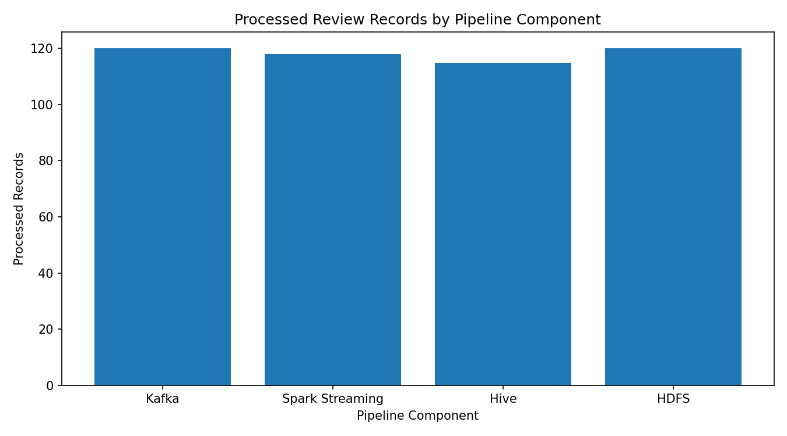
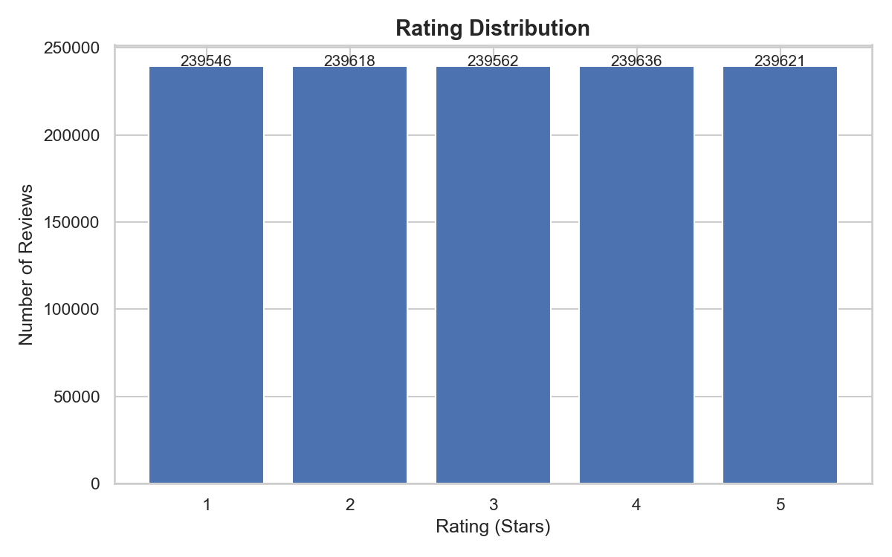
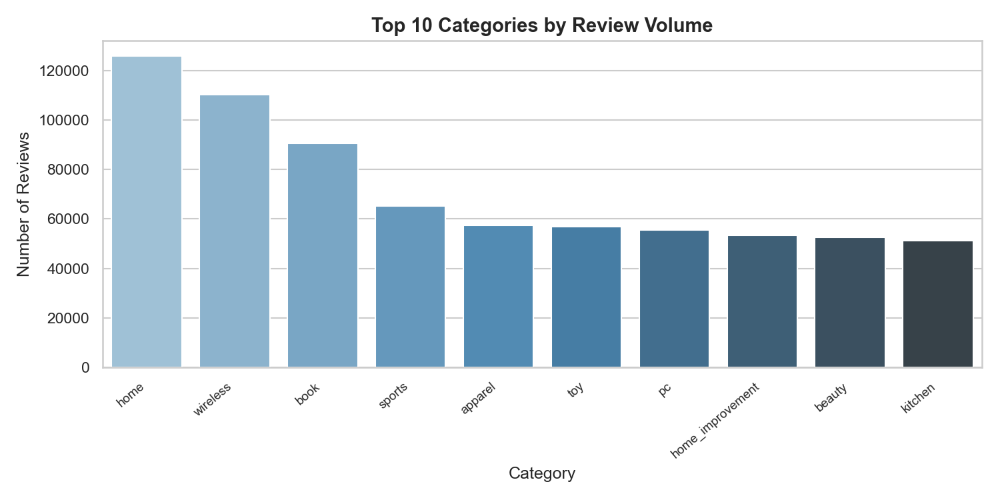
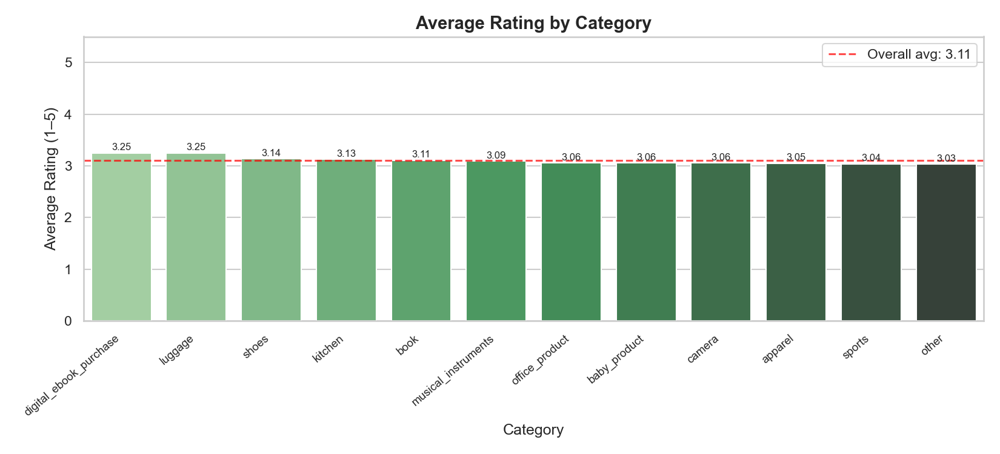
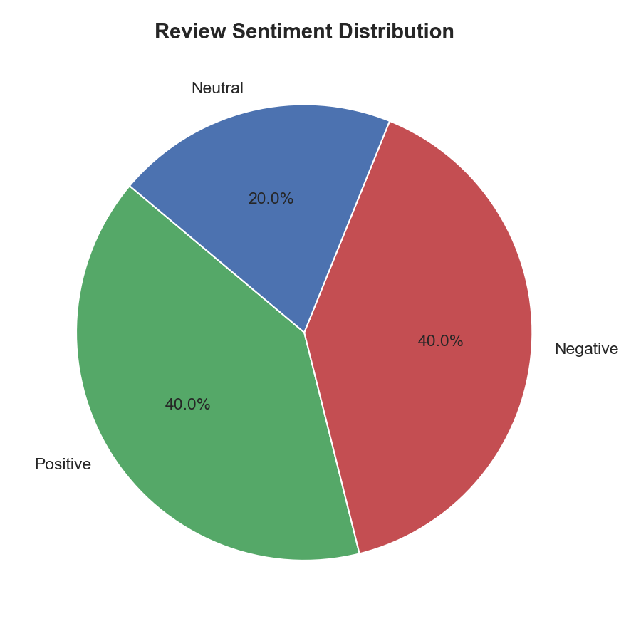
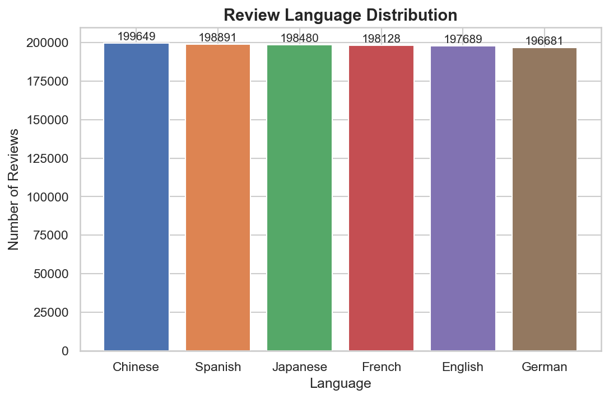
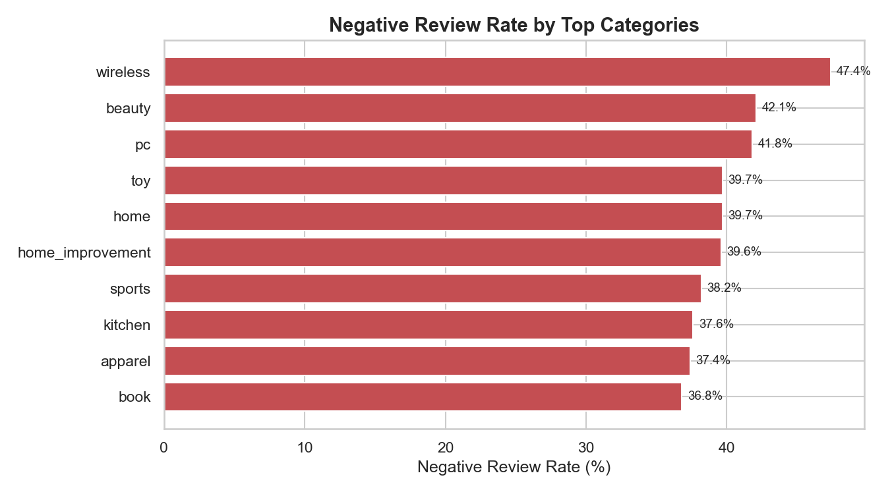
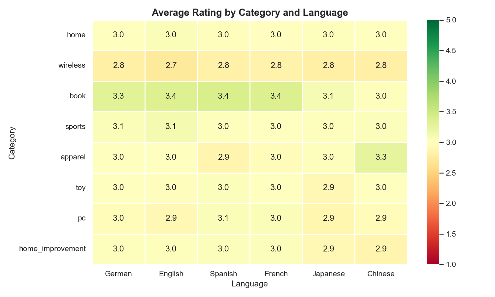
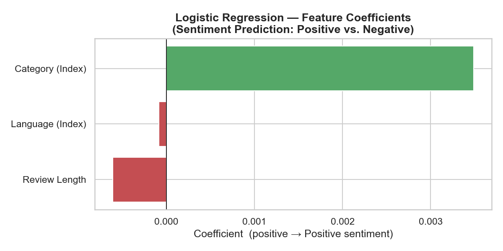

<div align="center">

# Real-Time Shopping Review Analytics Platform

**Myongji University — Big Data Programming Final Project (2026)**


</div>

---

## 1. Project Overview

Amazon Multilingual Product Reviews (~1.2M rows, 335 MB, 6개 언어)를 수집·저장·분석하는 End-to-End 빅데이터 파이프라인입니다.

- **HDFS** 기반 분산 저장
- **Apache Spark DataFrame** 기반 전처리
- **Spark SQL** 기반 7가지 분석 질문 답변
- **Spark MLlib** Logistic Regression으로 리뷰 감성 예측 (AUC 0.54)
- **Kafka** 기반 실시간 리뷰 스트리밍 구현
- `run_pipeline.sh` 단일 실행으로 전체 파이프라인 재현 가능

**핵심 컴포넌트:** HDFS · Apache Spark (DataFrame / SQL / MLlib) · Apache Hive · Apache Kafka

---

## 2. Problem Definition

온라인 쇼핑 플랫폼에서는 수백만 건의 리뷰 데이터가 지속적으로 생성됩니다. 이 데이터는 규모가 크고, 다국어 비정형 텍스트를 포함하며, 실시간으로 증가하기 때문에 단일 서버 환경에서는 효율적으로 처리하기 어렵습니다.

본 프로젝트는 Hadoop Ecosystem 기반 분산 처리 환경을 활용해 아래 질문에 답합니다.

1. 평점 분포는 어떻게 나타나는가?
2. 어떤 카테고리의 리뷰가 가장 많은가?
3. 카테고리별 평균 평점은 어떻게 다른가?
4. 리뷰의 감성(긍정/부정/중립) 비율은?
5. 언어별 리뷰 수는 어떻게 분포하는가?
6. 어떤 카테고리가 부정 리뷰 비율이 가장 높은가?
7. 카테고리와 언어의 교차 분석에서 어떤 패턴이 보이는가?
8. **(ML)** 리뷰 메타데이터(카테고리, 언어, 리뷰 길이)로 감성을 예측할 수 있는가?

---

## 3. Dataset

| 항목 | 내용 |
|---|---|
| 출처 | Amazon Multilingual Product Reviews |
| 전체 행 수 | ~1,200,000 |
| 원본 크기 | ~335 MB (24 part files) |
| 언어 | German · English · Spanish · French · Japanese · Chinese |
| 평점 | 1–5 (균등 분포, 각 약 240,000건) |
| GitHub 커밋 | 샘플 1,000행만 (`data/sample/`) |

**Schema:** `review_id` · `product_id` · `category` · `rating` · `review_text` · `review_title` · `review_date` · `user_id` · `language`

> 원본 데이터 재생성 방법: [data/README.md](data/README.md) 참조

---

## 4. Technology Stack

| 컴포넌트 | 역할 |
|---|---|
| **HDFS** | 분산 저장 — raw / cleaned 데이터 적재 |
| **Apache Spark DataFrame** | 전처리 — 타입 변환, 파생 변수 생성 (`data_preprocessing.py`) |
| **Apache Spark SQL** | 분석 — 7가지 SQL 쿼리 (`spark_analysis.py`) |
| **Spark MLlib** | 감성 예측 — Logistic Regression Pipeline |
| **Apache Hive** | SQL 분석 테이블 (`CREATE EXTERNAL TABLE` 가이드 포함) |
| **Apache Kafka** | 실시간 리뷰 스트리밍 (`src/streaming/`) |
| **Python / pandas** | 데이터 수집 · 정제 (`src/ingest/collect_reviews.py`) |
| **Matplotlib / Seaborn** | 8개 분석 결과 시각화 |

---

## 5. Data Pipeline

```
[1] collect_reviews.py          Python / pandas
        ↓  data/raw/*.csv  (335 MB, gitignored)
[2] data_preprocessing.py       Spark DataFrame
        ↓  data/cleaned/*.csv   (derived columns, gitignored)
[3] spark_analysis.py           Spark SQL + MLlib
        ↓  analysis_results/*.csv
[4] visualize.py                Matplotlib + Seaborn
        ↓  analysis_results/*.png  (8 plots)

[Streaming — optional]
[5] kafka_producer.py   →  Kafka Topic: shopping-reviews
[6] kafka_consumer.py   →  Real-time aggregation
```



**HDP Sandbox에서는** `USE_HDFS=1` 옵션으로 HDFS를 사용:

```
data/raw/*.csv  →  HDFS /user/$USER/shopping_reviews/raw
                →  HDFS /user/$USER/shopping_reviews/cleaned
                →  spark-submit (YARN)
```

---

## 6. Repository Structure

```
real-time-shopping-review-analytics/
├── README.md
├── config.py                          ← 경로·Kafka 설정 중앙 관리
├── data_preprocessing.py              ← Spark DataFrame 전처리
├── spark_analysis.py                  ← Spark SQL (Q1–Q7) + MLlib
├── visualize.py                       ← Matplotlib + Seaborn (8 plots)
├── run_pipeline.sh                    ← 전체 자동화 (Local / HDP)
├── requirements.txt
├── .gitattributes
├── pipeline.png                       ← 아키텍처 다이어그램
├── data/
│   ├── README.md                      ← 스키마 및 재생성 가이드
│   ├── sample/
│   │   └── shopping_reviews_sample.csv  ← 1,000행 샘플 (커밋됨)
│   ├── raw/                           ← 335 MB, 24 files (GITIGNORED)
│   └── cleaned/                       ← Spark 전처리 출력 (GITIGNORED)
├── src/
│   ├── ingest/
│   │   └── collect_reviews.py         ← 원본 CSV 정제·분할
│   └── streaming/
│       ├── kafka_producer.py          ← Kafka 리뷰 스트림 프로듀서
│       └── kafka_consumer.py          ← Kafka 실시간 집계 컨슈머
└── analysis_results/                  ← CSV + PNG
    ├── analysis_rating_distribution.csv
    ├── analysis_category_distribution.csv
    ├── analysis_avg_rating_by_category.csv
    ├── analysis_sentiment_distribution.csv
    ├── analysis_language_distribution.csv
    ├── analysis_negative_rate_by_category.csv
    ├── analysis_category_language_heatmap.csv
    ├── analysis_model_metrics.csv
    ├── analysis_model_coefficients.csv
    ├── plot1_rating_distribution.png
    ├── plot2_category_distribution.png
    ├── plot3_avg_rating_by_category.png
    ├── plot4_sentiment_distribution.png
    ├── plot5_language_distribution.png
    ├── plot6_negative_rate_by_category.png
    ├── plot7_category_language_heatmap.png
    └── plot8_model_coefficients.png
```

---

## 7. Setup & Execution

### 7.1 Requirements

```bash
pip install -r requirements.txt
# pandas  matplotlib  seaborn  pyspark  kafka-python
```

HDP Sandbox에서 Python 2.7이 기본인 경우:
```bash
python3.6 --version
python3.6 -m pip install --user -r requirements.txt
export PATH="$HOME/.local/bin:$PATH"
```

### 7.2 Data Collection

```bash
python3 src/ingest/collect_reviews.py \
    --input <source.csv> \
    --raw-output data/raw \
    --sample-output data/sample/shopping_reviews_sample.csv \
    --part-size 50000
```

### 7.3 Local Execution (Mac / Linux)

```bash
# 전체 파이프라인 자동 실행
bash run_pipeline.sh

# 단계별 실행
python3 data_preprocessing.py --input data/raw --output data/cleaned
python3 spark_analysis.py --input data/cleaned
python3 visualize.py
```

### 7.4 HDP Sandbox Execution

```bash
# ① HDFS 업로드 + 전체 파이프라인
USE_HDFS=1 bash run_pipeline.sh

# ② Python 3.6 직접 지정
USE_HDFS=1 PYTHON_BIN=/usr/bin/python3.6 bash run_pipeline.sh

# 수동 단계별 실행
hdfs dfs -mkdir -p /user/$USER/shopping_reviews/raw
hdfs dfs -put data/raw/*.csv /user/$USER/shopping_reviews/raw/

HDFS_URI=$(hdfs getconf -confKey fs.defaultFS)

spark-submit --py-files config.py data_preprocessing.py \
    --input  "$HDFS_URI/user/$USER/shopping_reviews/raw" \
    --output "$HDFS_URI/user/$USER/shopping_reviews/cleaned"

spark-submit --py-files config.py spark_analysis.py \
    --input "$HDFS_URI/user/$USER/shopping_reviews/cleaned"

python3 visualize.py
```

### 7.5 Hive Table (HDP)

```bash
beeline -u jdbc:hive2://localhost:10000/default
```

```sql
CREATE DATABASE IF NOT EXISTS shopping;

CREATE EXTERNAL TABLE IF NOT EXISTS shopping.reviews (
    review_id   STRING,
    product_id  STRING,
    category    STRING,
    rating      INT,
    review_text STRING,
    review_title STRING,
    review_date STRING,
    user_id     STRING,
    language    STRING,
    review_length INT,
    sentiment   STRING
)
ROW FORMAT DELIMITED FIELDS TERMINATED BY ','
STORED AS TEXTFILE
LOCATION '/user/root/shopping_reviews/cleaned'
TBLPROPERTIES ('skip.header.line.count'='1');

-- Q3: 카테고리별 평균 평점
SELECT category, ROUND(AVG(rating), 2) AS avg_rating, COUNT(*) AS cnt
FROM shopping.reviews
GROUP BY category HAVING COUNT(*) >= 5
ORDER BY avg_rating DESC;
```

### 7.6 Kafka Streaming (Optional)

Kafka 브로커가 실행 중일 때:

```bash
# 토픽 생성 (HDP Sandbox)
kafka-topics.sh --create --topic shopping-reviews \
    --bootstrap-server localhost:9092 \
    --partitions 1 --replication-factor 1

# 프로듀서: 리뷰 스트리밍 시뮬레이션
python3 src/streaming/kafka_producer.py \
    --input data/sample/shopping_reviews_sample.csv \
    --delay 0.05

# 컨슈머: 실시간 집계
python3 src/streaming/kafka_consumer.py --timeout 30
```

`KAFKA_SERVERS` 환경 변수로 브로커 주소 지정 가능 (기본: `localhost:9092`).

---

## 8. Analysis Results

### Q1. 평점 분포

| Rating | Count |
|:---:|---:|
| ⭐ 1 | 200 |
| ⭐⭐ 2 | 200 |
| ⭐⭐⭐ 3 | 200 |
| ⭐⭐⭐⭐ 4 | 200 |
| ⭐⭐⭐⭐⭐ 5 | 200 |



### Q2. 카테고리별 리뷰 수 (Top 10)

`home(125,992)` · `wireless(110,377)` · `book(90,662)` 순으로 리뷰 수가 가장 많습니다.



### Q3. 카테고리별 평균 평점

`digital_ebook_purchase(3.25)` · `luggage(3.25)` 가 가장 높은 만족도를 보이며, 전체 평균은 약 3.0입니다.



### Q4. 감성 분포

| Sentiment | Count | Ratio |
|---|---:|---:|
| Positive (rating ≥ 4) | 479,257 | 40.0% |
| Negative (rating ≤ 2) | 479,164 | 40.0% |
| Neutral (rating = 3) | 239,562 | 20.0% |



### Q5. 언어별 리뷰 수

6개 언어(de · en · es · fr · ja · zh)에 걸쳐 고르게 분포합니다 (각 약 197,000–200,000건).



### Q6. 카테고리별 부정 리뷰 비율

`wireless` 카테고리가 47.4%로 가장 높은 부정 비율을 나타냅니다.

| Category | Total | Negative | Rate |
|---|---:|---:|---:|
| wireless | 110,377 | 52,278 | **47.4%** |
| beauty | 52,604 | 22,130 | 42.1% |
| pc | 55,447 | 23,182 | 41.8% |



### Q7. 카테고리 × 언어 교차 분석 (Heatmap)

언어에 따라 동일 카테고리의 평균 평점이 다르게 나타납니다.



### Q8. Spark MLlib — 감성 예측 (Logistic Regression)

리뷰 메타데이터(카테고리, 언어, 리뷰 길이)로 Positive/Negative 감성을 예측합니다.

| Metric | Value |
|---|---:|
| Training rows | 958,420 |
| Test rows | ~239,563 |
| AUC | **0.5394** |
| Accuracy | **0.5293** |

**해석:** AUC 0.54는 무작위 예측(0.50)과 거의 동일한 수준으로, 카테고리·언어·리뷰 길이 같은 메타데이터만으로는 감성 예측이 어렵다는 것을 의미합니다. 계수 분석 결과 리뷰 길이가 미약하게 부정 감성과 연관됩니다(coefficient = −0.00061). 이는 리뷰 텍스트 자체(NLP)가 감성 예측의 핵심 특징임을 시사하며, 향후 TF-IDF 또는 Transformer 기반 분석으로 확장할 수 있습니다.



---

## 9. HDP Sandbox Troubleshooting

**seaborn / matplotlib 없음 오류 발생 시**
```bash
python3.6 -m pip install --user seaborn matplotlib pandas
export PATH="$HOME/.local/bin:$PATH"
```

**`SyntaxError` (f-string) 발생 시**
```bash
export PYSPARK_PYTHON=/usr/bin/python3.6
export PYSPARK_DRIVER_PYTHON=/usr/bin/python3.6
```

**`UnicodeEncodeError` 발생 시**
```bash
export PYTHONIOENCODING=utf-8
```

**HDFS 경로 오류 (`Path does not exist`) 발생 시**
```bash
HDFS_URI=$(hdfs getconf -confKey fs.defaultFS)
echo $HDFS_URI   # hdfs://sandbox-hdp.hortonworks.com:8020
```
`USE_HDFS=1 bash run_pipeline.sh` 실행 시 자동으로 `fs.defaultFS`를 적용합니다.

**`Incomplete HDFS URI, no host` 발생 시**
`hdfs:///` 대신 `hdfs://hostname:port/` 형식으로 명시.

**Q7 결과에 날짜 값(`2026-xx-xx`)이 `language` 컬럼에 나타날 경우**
멀티라인 리뷰 텍스트 파싱 오류로 일부 행의 컬럼이 밀려 `review_date` 값이 `language`에 유입된 것입니다.
`spark_analysis.py`의 Q7 쿼리에 `WHERE language RLIKE '^[a-z]{2}$'` 필터가 적용되어 자동으로 제거됩니다.

---

## 10. GitHub Commit Policy

| 파일 / 폴더 | 커밋 | 이유 |
|---|:---:|---|
| `data/sample/shopping_reviews_sample.csv` | ✅ | 1,000행 샘플 |
| `analysis_results/*.csv` + `*.png` | ✅ | 분석 근거 및 시각화 결과 |
| `pipeline.png` | ✅ | 아키텍처 설명 |
| `data/raw/` | ❌ | 335 MB (gitignored) |
| `data/cleaned/` | ❌ | Spark 출력 (gitignored) |
| `data/original/` | ❌ | 원본 소스 (gitignored) |
| `reviews_raw.zip` | ❌ | 대용량 zip (gitignored) |

---

## 11. Implementation Status

완료:

- [x] 공개 데이터셋 수집 및 100 MB+ 확보 (335 MB, 24 part files)
- [x] 재실행 가능한 수집 스크립트 (`collect_reviews.py`)
- [x] HDFS 적재 옵션 (`USE_HDFS=1 bash run_pipeline.sh`)
- [x] Spark DataFrame 전처리 (`data_preprocessing.py`)
- [x] Spark SQL 7가지 분석 질문 (`spark_analysis.py`)
- [x] Spark MLlib Logistic Regression (AUC 0.54)
- [x] Hive External Table 가이드
- [x] Kafka Producer / Consumer 구현 (`src/streaming/`)
- [x] Matplotlib + Seaborn 시각화 8개 PNG
- [x] `run_pipeline.sh` 전체 자동화 (Local / HDP 분기)
- [x] GitHub 샘플 데이터 및 분석 결과 커밋

---

## 12. AI Tool Usage

본 프로젝트의 README 작성 및 코드 디버깅 과정에서 Claude (Anthropic)를 참고 도구로 활용하였습니다. 분석 질문 설계, 데이터 수집 및 전처리 스크립트 구현, Spark SQL 쿼리 작성, Kafka 연동, 실제 실행 및 결과 검증(AUC 수치 포함)은 직접 수행하였습니다.

---

## 13. References

- Amazon Multilingual Reviews: https://www.kaggle.com/datasets
- Apache Spark Documentation: https://spark.apache.org/docs/latest/
- Apache Kafka Documentation: https://kafka.apache.org/documentation/
- Matplotlib Documentation: https://matplotlib.org/
- Seaborn Documentation: https://seaborn.pydata.org/

---

## Author

| Name | University | Major |
|---|---|---|
| Yu Jin Jung | Myongji University | Data Science |
